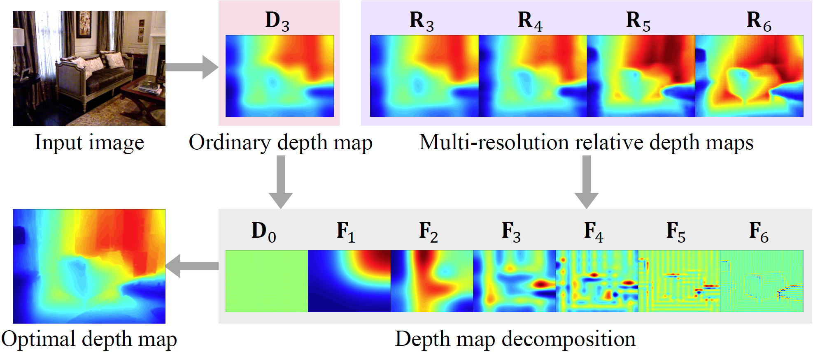

# [CVPR 2019] Monocular Depth Estimation Using Relative Depth Maps


## Paper

[**Monocular Depth Estimation Using Relative Depth Maps**](http://openaccess.thecvf.com/content_CVPR_2019/papers/Lee_Monocular_Depth_Estimation_Using_Relative_Depth_Maps_CVPR_2019_paper.pdf)

[(Supplemental) Monocular Depth Estimation Using Relative Depth Maps](http://openaccess.thecvf.com/content_CVPR_2019/supplemental/Lee_Monocular_Depth_Estimation_CVPR_2019_supplemental.pdf)

If you use our code or results, please cite:

```
@InProceedings{Lee_2019_CVPR,
  author = {Lee, Jae-Han and Kim, Chang-Su},
  title = {Monocular Depth Estimation Using Relative Depth Maps}, 
  booktitle = {The IEEE Conference on Computer Vision and Pattern Recognition (CVPR)},
  month = {June},
  year = {2019}
}
```

## Snapshot
You can download our trained caffemodel from the following link: [default_mode_net.caffemodel](https://drive.google.com/file/d/1w0BNsQH3hUKVh4pjpmfsryTc77OXlCGB/view?usp=sharing)

## Dataset
You should download 'nyu_depth_v2_labeled.mat' and 'splits.mat' files from official NYUv2 site: [nyu_depth_v2_labeled.mat](https://cs.nyu.edu/~silberman/datasets/nyu_depth_v2.html), [splits.mat](https://cs.nyu.edu/~silberman/projects/indoor_scene_seg_sup.html)

## Results
The results of our algorithm of 654 test images of NYUv2 set are located in 'results/depth_map'.
All depth maps are stored as png files, and each pixel consists of 16 bits of data.
You can convert png files to depth values in the following ways:
```
png_depth = imread('depth_test001.png');
depth = double(png_depth) / (2^16-1) * 10;
```
